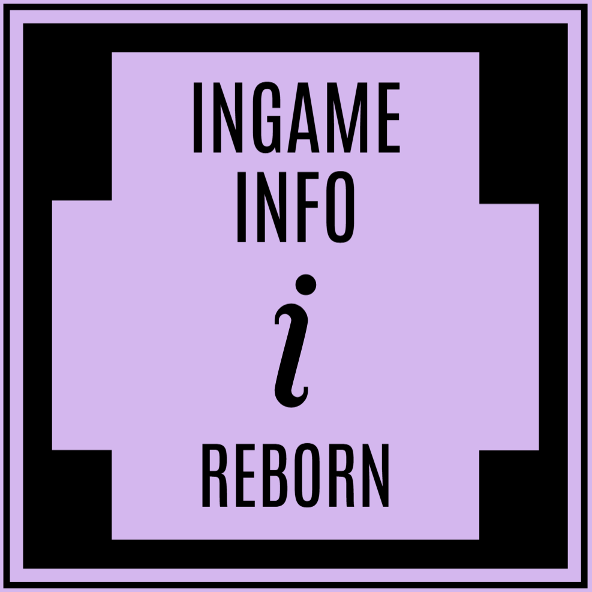

<div align="center">
  
  <h1>InGame Info Reborn</h1>
</div>

[](https://www.curseforge.com/minecraft/mc-mods/ingame-info-reborn)
[](https://www.curseforge.com/minecraft/mc-mods/ingame-info-reborn)
[](https://modrinth.com/mod/ingame-info-reborn)

This is a spiritual successor of [InGame-Info-XML](https://github.com/Lunatrius/InGame-Info-XML), **not a fork**. Moreover, this is evolving into a general-purpose HUD/GUI library for both Java and ZenScript users.

If you like this project, don't forget to give it a star⭐!

Suggestions/PRs are welcome

## Overview
This is a library mod that helps you to create in-game overlaid (or focused) GUI with ease.


(Nothing will pop up with the default configuration!)

### Architectural Modules Chart

<details>
<summary>Click to Expand</summary>

| Module                             | Role                                                             | Status        |
|------------------------------------|------------------------------------------------------------------|---------------|
| **MVVM Base**                      | Separates logic (ViewModel) from rendering (View)                | ✅ Done        |
| **XML-Style DSL For View**         | Declarative XML-style layout to build static UI trees            | ✅ Done        |
| **Reactive Binding**               | View reacts to changes in ViewModel automatically                | ✅ Done        |
| **Compose (Powered by Slot)**      | Immediate-mode UI embedded in ViewModel                          | ⚠️ Partially  |
| **Snapshot Diffing**               | Virtual tree diffing for Compose-based UI                        | ✅ Done        |
| **Shared Context**                 | Shared runtime context between ViewModel and Compose blocks      | ✅ Done        |
| **DOM-Like Event System**          | Input propagation and event capturing/bubbling                   | ✅ Done        |
| **Interactable Control**           | Captures input, intercepts propagation (works with Event System) | ✅ Done        |
| **Fixed / Render Update**          | Dual update loop for logic vs animation                          | ✅ Done        |
| **Annotation Driven Lerp Utility** | Utility for smooth interpolation during render updates           | ✅ Done        |
| **Transition API**                 | Externally trigger view transitions                              | 🚧 Planned    |
| **Theme Manager**                  | Global theme system (colors, font scale, etc)                    | ✅ Mostly Done |
| **Render Op Queue**                | Abstract draw commands for controls                              | ✅ Done        |
| **Modal Layer**                    | Stack-based modal / dialog system                                | 🚧 Planned    |

</details>

### Declarative GUI Example:
```xml
<VerticalGroup>
    <HorizontalGroup>
        <Text text = "Memory: ">
        <ProgressBar uid = "memoryBar" 
                     width = 40 
                     height = 3 
                     alignment = CENTER 
                     pivot = CENTER 
                     padding = {"right": 5}>
        <Text uid = "memory">
    </Group>
    <Text uid = "fps">
</Group>
```
```java
@Reactive(targetUid = "fps", property = "text", initiativeSync = true)
public ReactiveObject<String> fpsText = new ReactiveObject<>(){};

EventCenter.gameFpsEvent.addListener((fps) ->
{
    fpsText.set("FPS: " + fps);
});

... more bindings
```

## Wiki
- [Wiki Link](https://tttsaurus.github.io/Ingame-Info-Reborn-Wiki/)

## Implementation Todo List / Overview
<details>
<summary>Click to Expand</summary>

_**Currently working on the architecture.**_<br>
_**Not adding controls or QoL updates.**_

My Detailed Todo List:
- https://trello.com/b/MTLHeyGn/ingameinfo

Implementation Overview:
- Add framebuffer to the GUI rendering life cycle (✔)
- Introduce a custom GUI container (✔)
- Maintain a list of GUI containers so that GUIs can stack together (✔)
- A GUI container can be ingame-overlaid/focused (runtime switchable) (✔)
- Introduce feature-rich GUI layout
  - Pivot (✔)
  - Alignment (✔)
  - Padding (✔)
  - Horizontal Group (stack elements horizontally) (✔)
  - Vertical Group (stack elements vertically) (✔)
  - Sized Group (✔)
  - Nesting Groups (group in group) (✔)
  - Adaptive Group (fit elements into it adaptively)
  - Foldout Group
  - Draggable Group
- Add controls like text, button, input field, etc.
  - Text (✔)
  - Sliding Text (✔)
  - Anim Text (✔)
  - Button (✔)
  - Checkbox
  - Input Field
  - Image (✔)
  - Url Image (✔)
  - GIF
  - Slide Bar
  - Progress Bar (✔)
  - Item (✔)
- Add CrT/Zenscript support (✔)
- Ingame spotify support (go to wiki for details) (✔)

</details>

## Latest Build
In case you want to use the latest action build
- Go to [GitHub Actions](https://github.com/tttsaurus/Ingame-Info-Reborn/actions)
- Click on the latest workflow
- Scroll down to the bottom and download the `Artifacts`
- Unzip and `ingameinfo-[version].jar` is the mod file

## Credits
- Created using [GregTechCEu's Buildscripts](https://github.com/GregTechCEu/Buildscripts)
- Inspired by [InGame-Info-XML](https://github.com/Lunatrius/InGame-Info-XML)
- Bundled [Configurate](https://github.com/SpongePowered/Configurate) licensed under Apache-2.0
